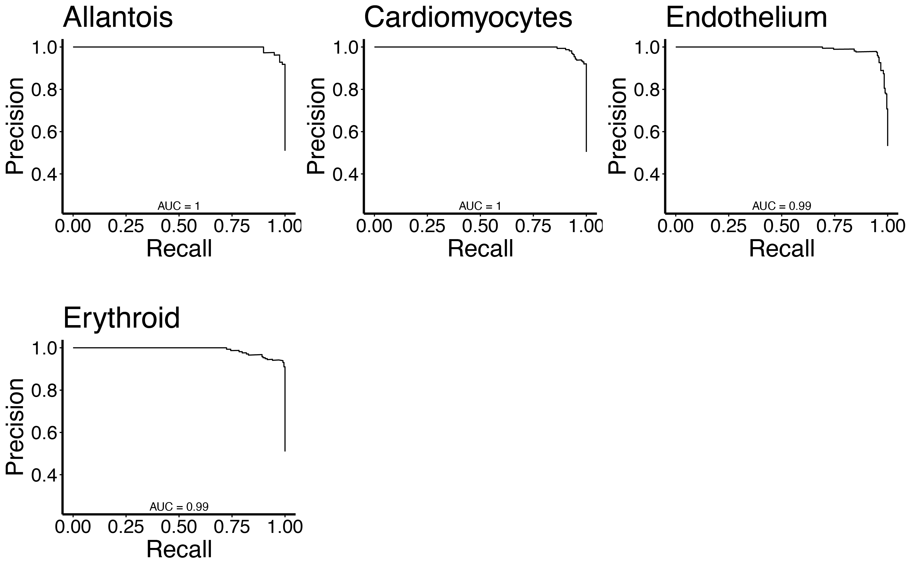

<a id="TopofBAGofMotifsTutorial_v1"></a>
<h1><font color="brown"> Using BOM to interrogate distal regulatory elements</font></h1>


<ul><li><a href="#BAGofMotif_Installation">Installation note</a></li>
    <li><a href="#Step1PeakFilter">Step 1 Peak Preprocessing (optional)</a></li>
    <li><a href="#Step2MotifSearching">Step 2 Motif Annotation</a></li>
    <li><a href="#Step3MotifCounting">Step 3 Model Training</a></li>
    <li><a href="#Step4Predicting">Step 4 Model Prediction</a></li>
    <li><a href="#Step5SHAP_interpretations">Step 5 Model Interpretation</a></li>
    <li><a href="#BOM_references">References</a></li>
</ul>


<br>
This tutorial uses regulatory regions from four cell types from snATAC-seq data of whole mouse embryo "mouseE8.25_4CellTypes.bed" [1]. The full dataset comprises of 17 cell types but we have restricted to four for the tutorial. snATAC-seq peaks were associated to cell types based on differential accessibility. 

In this tutorial, we are using binary classification to examine our regulatory regions. This means that the positive and negative (background) sets are balanced in numbers. We also use stratified sampling to ensure that the each class (e.g. cell type) is equally well represented in the negative set.

Note that if you are working with snATAC-seq data using Signac and ArchR, these methods have inbuilt tests to provide sets of marker peaks for each cell cluster which can be used as input. 


<a id="BAGofMotif_Installation"></a>
<h3><font color="brown">Installation note</font></h3>


```R
# For more information on dependancies see main page
devtools::install_github("ewonglab/BOM_package")

```


---
<a id="Step1PeakFilter"></a>
<h3><font color="brown"> Step 1 Peak filter</font></h3>

BOM takes as input a table of genomic coordinates labeled with one or more cell types/states. Input should have 4 columns (chr, start, end, condition). 

The function "filterCREs" has some useful options to filter the peaks. Here, we are focusing on cell-type specific distal elements, thus we remove peaks located within 1kb from a TSS and peaks overlapping exons. We also adjust the width of each element so that each peak is centered and spans 500bp (parameter nbp) in total. We remove peaks annotated to multiple cell types. 

This step is optional in that the preprocessing really depends on your research question. BOM is flexible and you may already have the exact sets of sequences you want to interrogate, in which case you may decide to forego this step with your data. 

We find that BOM models are not predictive if the class is too small (e.g. < 100 CREs). You may want to consider filtering out these classes.

Possible filter options within filterCREs include
 
- keeping only regions that are proximal to a transcription start site (TSS)
- keeping only regions located distally
- remove any regions overlapping exons
- adjust the width of the regions to ensure concistency. 


Required arguments:
- 'input_bed' : provide peak data in .bed format.
- 'annot'     : provide a genome annotation file (*.gtf).
- 'chr_sizes' : provide a genome size file.
- 'out_bed'   : provide a output filename.


```R
date() # takes ~2mins to complete
library(BagOfMotifs)
# Package contains 
extdata_path <- system.file("extdata",package = "BagOfMotifs")
input_bed <- paste0(extdata_path,'/mouseE8.25_4CellTypes.bed')
chr_sizes <- paste0(extdata_path,'/mouse.chrom.sizes.txt') #https://hgdownload.soe.ucsc.edu/goldenPath/mm10/bigZips/
annot     <- paste0(extdata_path, '/Mus_musculus.GRCm38.92.gtf.gz') #gencode mm10 mouse gene model

filterCREs(inputBedFile = input_bed, annotFile = annot, chrSizes = chr_sizes,
                        u = 1000, d = 1000,
                        keep_proximal = FALSE,
                        remove_proximal = TRUE,
                        non_exonic = TRUE, out_bed = "mouseE8.25_4CellTypes_filt.bed",
                       ovr_dir=TRUE,
                        celloutputDir =  "./mouse_4ct/")
date()
```


'Thu Dec 21 12:36:42 2023'


    Reading CREs...
    
    
    Reading genome annotation...
    
    
    Import genomic features from the file as a GRanges object ... 
    OK
    
    Prepare the 'metadata' data frame ... 
    OK
    
    Make the TxDb object ... 
    OK
    
    Removing exonic regions...
    
    
    Removing proximal regions to TSSs...
    
    


    Reading chromosome sizes...
    Adjusting CRE length...


    Removing 135 regions as they were truncated to a length smaller than 500 nt (i.e. were located near the edge of a chromosome)
    
    Saving 3892 CREs...
    
    
    Preparing output directories and files so that everything is set for motif searching
    
    The following files have been prepared: 
    Endothelium.bed
    Cardiomyocytes.bed
    Erythroid.bed
    Allantois.bed
    


'Thu Dec 21 12:37:52 2023'


---
<a id="Step2MotifSearching"></a>
<h3><font color="brown"> Step 2 Motif Searching</font></h3>


This step uses FIMO from the MEME Suite. We use vertebrate motifs from [GIMME Motifs](https://github.com/vanheeringen-lab/gimmemotifs) [2].
Note please FIMO version 5.5.0 or earlier.


This step identifies transcription factor (TF) binding motifs within the CRE using FIMO.

Files that have ~1000 peaks will take approximately 5 minutes. 

Input file should have 4 columns (chr, start, end, condition). 


```R
# We generate fasta files for the peaks specific to each cell type
getwd()
library(BagOfMotifs)
Mmusculus <- BSgenome.Mmusculus.UCSC.mm10::BSgenome.Mmusculus.UCSC.mm10
generateAllFasta(bedDir = "./mouse_4ct/", genome = Mmusculus, fastaDir = "./mouse_4ct/")
```


'/g/data/zk16/genomicsCore/jupyter/mouse_enh_grammar/vignette_4celltypes'


    Creating 4 output fasta files
    
    Fasta files generated
    


```R
# Identify motifs from 
fimo_path = 'path/to/fimo'
fimo_path <- '/g/data/zk16/genomicsCore/software/'
motifs_path <- "./extdata/gimme.vertebrate.v5.0.meme")
date()
BagOfMotifs::runFIMO(input_path = './mouse_4ct/', motifs_path = motifs_path, p_thresh = 0.0001, 
                   out_path = './mouse_4ct/', FIMO_path = fimo_path)
date()
```

If you have many sequences, you can also run FIMO using gnu parallel on the command line:


```R
#Example of how to run FIMO using bash parallel via bash command line 

cd directory_containing_fastaFiles

mkdir mouseE8.25_motifs

ls *.fasta | parallel fimo --thresh 0.001 --o {.} gimme.vertebrate.v5.0.meme mouseE8.25_motifs/{}
```

---
<a id="Step3MotifCounting"></a>
<h3><font color="brown"> Step 3 Motif counting and model training</font></h3>


We split the data to training, validation and test sets. Data matrix for every model contains a similar number of positive (target cell type CREs) and negative instances (background). Non-target cell types are equally represented in the background set.

Required arguments for this function include:

- 'target_ct'   : Target cell type condition. Leaving target_ct as NULL means all cell types will be processed
- 'data_path'   : Path to directoy containing motifs
- 'qval_thresh' : q value threshold
- 'outDir'      : Name of directory to save output files. Output files will be named cellType_vs_Others


```R
# prepare counts for binary classifications

date() # takes ~2-3 mins to run for all celltypes 


binModel(target_ct = NULL, data_path = './mouse_4ct/', qval_thresh = 0.5
        , early_stopping_rounds = 100, print_every_n = 100, nthread = 2
        , outDir = './mouse_4ct/')
date()
```


'Thu Dec 21 10:41:14 2023'


    Loading required package: foreach
    
    Loading required package: doParallel
    
    Loading required package: iterators
    
    Loading required package: parallel
    
    Reading input data from ./mouse_4ct/.
    There are 4 directories found.
    
    Writing output
    
    Processing all cell types
    
    Training....
    
    Preparing training for Allantois
    
    Saving CRE ids of training, validation and test sets...
    
    Preparing training for Cardiomyocytes
    
    Saving CRE ids of training, validation and test sets...
    
    Preparing training for Endothelium
    
    Saving CRE ids of training, validation and test sets...
    
    Preparing training for Erythroid
    
    Saving CRE ids of training, validation and test sets...
    
    Complete
    


'Thu Dec 21 10:42:04 2023'


```R
counts <- read.table(file = "./mouse_4ct/Cardiomyocytes_vs_Others.txt", header = T, 
                     stringsAsFactors = F, sep = '\t')
head(counts[,c(head(colnames(counts)), tail(colnames(counts), 2))])

```


<table class="dataframe">
<caption>A data.frame: 6 × 8</caption>
<thead>
	<tr><th></th><th scope=col>GM.5.0.AP.2.0001</th><th scope=col>GM.5.0.AP.2.0002</th><th scope=col>GM.5.0.AP.2.0003</th><th scope=col>GM.5.0.AP.2.0004</th><th scope=col>GM.5.0.AP.2.0005</th><th scope=col>GM.5.0.AP.2.0006</th><th scope=col>celltype</th><th scope=col>binary_celltype</th></tr>
	<tr><th></th><th scope=col>&lt;int&gt;</th><th scope=col>&lt;int&gt;</th><th scope=col>&lt;int&gt;</th><th scope=col>&lt;int&gt;</th><th scope=col>&lt;int&gt;</th><th scope=col>&lt;int&gt;</th><th scope=col>&lt;chr&gt;</th><th scope=col>&lt;int&gt;</th></tr>
</thead>
<tbody>
	<tr><th scope=row>chr10:111680833-111681333</th><td>0</td><td>0</td><td>0</td><td>0</td><td>0</td><td>0</td><td>Erythroid  </td><td>0</td></tr>
	<tr><th scope=row>chr10:114633874-114634374</th><td>0</td><td>0</td><td>0</td><td>1</td><td>0</td><td>0</td><td>Endothelium</td><td>0</td></tr>
	<tr><th scope=row>chr10:116266783-116267283</th><td>0</td><td>0</td><td>0</td><td>0</td><td>0</td><td>0</td><td>Endothelium</td><td>0</td></tr>
	<tr><th scope=row>chr10:117732122-117732622</th><td>1</td><td>2</td><td>2</td><td>0</td><td>0</td><td>0</td><td>Erythroid  </td><td>0</td></tr>
	<tr><th scope=row>chr10:121962019-121962519</th><td>0</td><td>0</td><td>0</td><td>0</td><td>0</td><td>0</td><td>Endothelium</td><td>0</td></tr>
	<tr><th scope=row>chr10:121971621-121972121</th><td>0</td><td>0</td><td>0</td><td>0</td><td>0</td><td>0</td><td>Endothelium</td><td>0</td></tr>
</tbody>
</table>


---
<a id="Step4Predicting"></a>
<h3><font color="brown"> Step 4 Predicting</font></h3>


Now, we can use the trained models to predict on the test sets using **"predict_binary"**. 


```R
BagOfMotifs::predict_binary_multi(inputMotif_dir = './mouse_4ct/'
                                  , inputXGB_dir = './mouse_4ct/'
                                  , outputTrain_dir = './mouse_4ct/'
                                  , pred_dir = './mouse_4ct/'
                                  , outputFile = './mouse_4ct/mouseE8.25_ROCs.pdf')
```

    Preparing Allantois_vs_Others predict binary output
    
    Preparing Cardiomyocytes_vs_Others predict binary output
    
    Preparing Endothelium_vs_Others predict binary output
    
    Preparing Erythroid_vs_Others predict binary output
    


The output file contains 3 columns. The first column indicates the true class of the CRE, 1 representing cardiomyocyte CRE and 0 representing background CRE. The second column represents the predicted classes coded as a binary with a threshold of > 0.5. The last column represents the predicted probability by the model. We can use these values to calculate some metrics of performance. 

Prediction metrics including area under the ROC curve (auROC), area under the precision/recall curve (auPR), accuracy, F1 score, recall and precision and provided for all cell types. ROC curves and a precision/recall curves are provided.

We can generate precision/recall curves across all the models with the function **"prcurve_multi"**


```R
prcurve_multi(inputMotif_dir = "./mouse_4ct/"
              , inputXGB_dir = "./mouse_4ct/"
              , outputFile = "./mouse_4ct/mouseE8.25_PRcurvess.pdf")
```

    Loading required package: cowplot
    
    Preparing Allantois_vs_Others PR curve
    
    Preparing Cardiomyocytes_vs_Others PR curve
    
    Preparing Endothelium_vs_Others PR curve
    
    Preparing Erythroid_vs_Others PR curve
    





We can save the prediction statistics across all the models.


```R
# Looking at the binary prediction statistics
save_binStats(pred_dir = "./mouse_4ct/" , out_file="./mouse_4ct/binStats")
read.table(file = "./mouse_4ct/binStats", header =T)

```

    Using files ending with pattern 'pred.txt'
    


<table class="dataframe">
<caption>A data.frame: 4 × 8</caption>
<thead>
	<tr><th scope=col>Model</th><th scope=col>Accuracy</th><th scope=col>auPR</th><th scope=col>auROC</th><th scope=col>F1</th><th scope=col>MCC</th><th scope=col>Precision</th><th scope=col>Recall</th></tr>
	<tr><th scope=col>&lt;chr&gt;</th><th scope=col>&lt;dbl&gt;</th><th scope=col>&lt;dbl&gt;</th><th scope=col>&lt;dbl&gt;</th><th scope=col>&lt;dbl&gt;</th><th scope=col>&lt;dbl&gt;</th><th scope=col>&lt;dbl&gt;</th><th scope=col>&lt;dbl&gt;</th></tr>
</thead>
<tbody>
	<tr><td>Allantois_vs_Others     </td><td>0.942</td><td>0.996</td><td>0.996</td><td>0.940</td><td>0.888</td><td>0.986</td><td>0.899</td></tr>
	<tr><td>Cardiomyocytes_vs_Others</td><td>0.951</td><td>0.995</td><td>0.995</td><td>0.951</td><td>0.902</td><td>0.959</td><td>0.943</td></tr>
	<tr><td>Endothelium_vs_Others   </td><td>0.933</td><td>0.990</td><td>0.987</td><td>0.934</td><td>0.870</td><td>0.978</td><td>0.895</td></tr>
	<tr><td>Erythroid_vs_Others     </td><td>0.962</td><td>0.990</td><td>0.990</td><td>0.964</td><td>0.926</td><td>0.939</td><td>0.990</td></tr>
</tbody>
</table>


---
<a id="Step5SHAP_interpretations"></a>
<h3><font color="brown"> Step 5 SHAP interpretations </font></h3>

BOM leverages the usage of SHapley Additive exPlanations (SHAP) to estimate the contribution of each TF binding motif to the classification tasks (Lundberg et al 2020). SHAP values are calculated for each TF binding motif (columns) and for each CRE (rows) in the training set. X-axis represent log-odds units, before logistic link function. A positive SHAP value represents a contribution towards a positive outcome (CRE being classified as the target class/cell type/state) whereas a negative value represents a contribution towards the negative/background class. The magnitude of SHAP values is also informative, a high absolute value represents a higher contribution.

By using the function **"save_shap"** for a single model or **"save_shap_multi"** for multiple models, SHAP values will be saved to a file. The examples below show how to save SHAP values. You can either provide a list of models and training sets or a path to the data.


```R
save_shap_multi(dataDir = "./mouse_4ct/", outDir = "./mouse_4ct/")
```

    Loading required package: shapviz
    


Using the SHAP values we can produce a series of plots to explore the importance of TF binding motifs in the classification tasks. The different plot options are summarized below:

**Bar plot:**
SHAP barplots represent a ranking of the most important motifs for the classification tasks across all CREs (y-axis). By default, the values shown in the x-axis of this type of plot are the mean of |SHAP| for each TF binding motif across all CREs, however the user can choose the sum of |SHAP| instead.

**Beeswarm plot:**
In a beeswarm plot, the Y-axis also represents the TF binding motif ranking, by default, based on the sum of |SHAP| across CREs. In this type of plot each CRE is represented by a dot and the SHAP scores are signed values centered on zero (x-axis). Dots are coloured by the TF binding motif count normalised to 0-1 range.

**Watterfall plot:**
Waterfall plots represent the contribution of the most important TF binding motifs in the classification task. Positive and negative SHAP values are represented by arrows in oposite directions. Motifs are ranked by the magnitude of their contribution. The sign and magnitude or the SHAP score is shown in each case. Additionally, waterfall plots show predicted value of the model, denoted as 'F(x)'. The mean prediction value across all CREs is also shown ('E[f(x)]').

Waterfall plots can display the SHAP values of single CREs or CRE sets, at least one CRE ID should be specified. If multiple CRE IDs are provided and if average_shap is set to TRUE (default), the average SHAP across the CREs specified will be displayed. If average_shap is FALSE, o set of waterfall plots will be produced, one for each CRE.


```R

# Load summary annotation table which is provided in BagOfMotifs package. 
extdata_path <- system.file("extdata",package = "BagOfMotifs")
gimme.fn <- paste0(extdata_path,"/gimme.vertebrate.v5.0.annot_summarized_shorten.txt.gz")
gimme_annot <- read.table(gimme.fn,header = TRUE, fill = TRUE)


# By providing the path to the models and training sets, a plot will be produced for each model. 
# If we provide annotDat then the Y-axis will populate with both the motif ID plus the transcription factor name
# Note the default is to truncate the Y-axis labels to 30 characters as some names interfere with plot sizes. 
# This can be changed with parameter annotLength.
# If parameter annotDat is not provided then only the generic motif name is used for labels
p <- shapPlots_multi(dataDir = "./mouse_4ct/", annotDat = gimme_annot)
models <- list.files(path = "./mouse_4ct/", pattern="(.*)rds$")

# adding titles
for(i in 1:length(p)){p[[i]] <- p[[i]] + ggtitle(sub(".rds", "", models[i]))}
p
```

    Loading required package: ggplot2
    
    Loading required package: gggenes
    
    Loading required package: shades
    


    

    

    


    
    


```R

p <- shapPlots_multi(dataDir = "./mouse_4ct/", plotType = "beeswarm", annotDat = gimme_annot)

# Model names
models <- list.files(path = "./mouse_4ct/", pattern="(.*)rds$")

# adding titles
for(i in 1:length(p)){p[[i]] <- p[[i]] + ggtitle(sub(".rds", "", models[i]))}
p
```

    Scale for colour is already present.
    Adding another scale for colour, which will replace the existing scale.
    Scale for colour is already present.
    Adding another scale for colour, which will replace the existing scale.
    Scale for colour is already present.
    Adding another scale for colour, which will replace the existing scale.
    Scale for colour is already present.
    Adding another scale for colour, which will replace the existing scale.


    

    


    

    


    [[1]]
    
    [[2]]
    
    [[3]]
    
    [[4]]


    

    


    

    


```R
xgb_model <- readRDS("././mouse_4ct/Cardiomyocytes_vs_Others.rds")
train_set <- read.table(file = "./mouse_4ct/Cardiomyocytes_vs_Others_train.txt", header = TRUE)

# Local explanation of a cardiomyocyte CRE ("chr10:104684658-104685158") in the cardiomyocyte model
# Note that producing multiple waterfall plots across multiple models using the function "shapPlots_multi" will produce warnings if the CRE is not present in all the datasets.
shapPlots(xgb_model = xgb_model, ts = train_set
               , plotType = "waterfall", max_display = 10
               , CRE_ids = "chr10:104684658-104685158"
               , annotDat = gimme_annot)
```


    

    


```R
sessionInfo()
```


    R version 4.1.0 (2021-05-18)
    Platform: x86_64-pc-linux-gnu (64-bit)
    Running under: Rocky Linux 8.8 (Green Obsidian)
    
    Matrix products: default
    BLAS/LAPACK: /apps/intel-oneapi/mkl/2021.2.0/lib/intel64/libmkl_intel_lp64.so.1
    
    locale:
     [1] LC_CTYPE=C.UTF-8    LC_NUMERIC=C        LC_TIME=C          
     [4] LC_COLLATE=C        LC_MONETARY=C       LC_MESSAGES=C      
     [7] LC_PAPER=C          LC_NAME=C           LC_ADDRESS=C       
    [10] LC_TELEPHONE=C      LC_MEASUREMENT=C    LC_IDENTIFICATION=C
    
    attached base packages:
    [1] stats     graphics  grDevices utils     datasets  methods   base     
    
    other attached packages:
    [1] shades_1.4.0      gggenes_0.5.1     ggplot2_3.4.4     shapviz_0.9.2    
    [5] BagOfMotifs_0.0.3
    
    loaded via a namespace (and not attached):
     [1] pillar_1.9.0      compiler_4.1.0    base64enc_0.1-3   tools_4.1.0      
     [5] ggfittext_0.10.1  digest_0.6.29     uuid_1.0-3        viridisLite_0.4.0
     [9] jsonlite_1.8.0    evaluate_0.15     lifecycle_1.0.4   tibble_3.2.1     
    [13] gtable_0.3.0      lattice_0.20-44   pkgconfig_2.0.3   rlang_1.1.2      
    [17] Matrix_1.3-3      IRdisplay_1.1     cli_3.6.1         IRkernel_1.3     
    [21] fastmap_1.1.0     withr_2.5.0       dplyr_1.1.4       repr_1.1.4       
    [25] generics_0.1.2    vctrs_0.6.5       tidyselect_1.2.0  xgboost_1.6.0.1  
    [29] grid_4.1.0        glue_1.6.2        data.table_1.14.2 R6_2.5.1         
    [33] fansi_1.0.2       pbdZMQ_0.3-7      farver_2.1.0      magrittr_2.0.2   
    [37] scales_1.3.0      htmltools_0.5.2   colorspace_2.0-3  labeling_0.4.2   
    [41] utf8_1.2.2        stringi_1.7.6     munsell_0.5.0     crayon_1.5.0     
    [45] Cairo_1.6-0      


---
<a id="BOM_references"></a>
<h3><font color="brown"> References</font></h3>

<a href="#TopofBAGofMotifsTutorial_v1">back to top of document</a>

1. Pijuan-Sala, B., Wilson, N. K., Xia, J., Hou, X., Hannah, R. L., Kinston, S., ... & Göttgens, B. (2020). Single-cell chromatin accessibility maps reveal regulatory programs driving early mouse organogenesis. Nature cell biology, 22(4), 487-497.
2. Bruse, N., & Heeringen, S. J. V. (2018). GimmeMotifs: an analysis framework for transcription factor motif analysis. BioRxiv, 474403.
3. Charles E. Grant, Timothy L. Bailey and William Stafford Noble, "FIMO: Scanning for occurrences of a given motif", Bioinformatics 27(7):1017-1018, 2011. [full text]
4. Quinlan, A. R., & Hall, I. M. (2010). BEDTools: a flexible suite of utilities for comparing genomic features. Bioinformatics, 26(6), 841-842.
5. Lundberg, S. M., Erion, G., Chen, H., DeGrave, A., Prutkin, J. M., Nair, B., ... & Lee, S. I. (2020). From local explanations to global understanding with explainable AI for trees. Nature machine intelligence, 2(1), 56-67.
