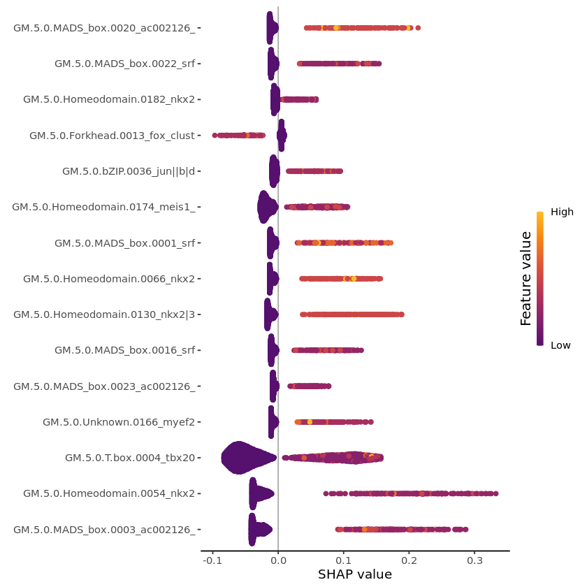

<a id="TopofBAGofMotifsTutorial_v1"></a>
<h1><font color="blue"> Getting started with Bag-of-Motifs for binary classification</font></h1>

BOM takes as input a table of regulatory region coordinates labeled with one or more cell types/states 

We present a walkthough using snATAC-seq data of whole mouse embryos resolved to 17 cell types (Pijuan-Sala et al 2020) . In this data, snATAC-seq peaks were annotated to cell types based on their differential accessibility compared to other cell types. If working with snATAC-seq data, Signac and ArchR have inbuilt tests to provide sets of marker peaks for each cell cluster which can be used as input. 

Document shortcut links:
<ul><li><a href="#BAGofMotif_Installation">Installation information</a></li>
    <li><a href="#BagOfMotif_QuickStart">Quick start</li>
    <li><a href="#Step1DataProcess">Step1 Prepare BED file</a></li>
    <li><a href="#Step2PeakFilter">Step2 Peak Filter</a></li>
    <li><a href="#Step3MotifSearching">Step3 Motif Searching</a></li>
    <li><a href="#Step4MotifCounting">Step4 Motif Counting</a></li>
    <li><a href="#Step5Predicting">Step5 Model Predicting</a></li>
    <li><a href="#Step7SHAP_interpretations">Step6 Shap interpretations</a></li>
    <li><a href="#BOM_references">References</a></li>
</ul>


---
<a id="BAGofMotif_Installation"></a>
<h3><font color="brown">Installation</font></h3>


```R
# If you havn't done so already install the BagOfMotifs R package. 
# You will need to install using the following command

 
devtools::install_github("ewonglab/BOM_package")

```

    Updating HTML index of packages in '.Library'
    
    Making 'packages.html' ...
     done
    
    Updating HTML index of packages in '.Library'
    
    Making 'packages.html' ...
     done
    
    


```R
# Set paths for this vignette
working_path <- '/results/'
setwd(working_path)

# There are a number of example files in package. 
# For the purpose of this vignette we define the required files for the vignette below
extdata_path <- system.file("extdata",package="BagOfMotifs")
motifs_path  <- paste0(extdata_path,"/gimme.vertebrate.v5.0.meme")
chr_sizes <- paste0(extdata_path, '/mouse_sizes_primary_genome_tab.txt')

```

---
<a id="BagOfMotif_QuickStart"></a>
<h3><b><font color="red">Quickstart</font></b></h3>

Starting data is either a bed file of pre-prepared entries or a text file with at least four columns (chromosome, start, stop, cell ID).


```R
# Load example DATA and convert to BED file
extdata_path <- system.file("extdata",package = "BagOfMotifs")
sampleData_filename <- paste0(extdata_path,'/Pijuan_etal_table_S6.csv.gz')
motifs_path  <- paste0(extdata_path,"/gimme.vertebrate.v5.0.meme")
chr_sizes <- paste0(extdata_path, '/mouse_sizes_primary_genome_tab.txt')

# Load pre-existing data (or replace this with your own)
bed_file <- paste0(working_path,'/mouseE8.25_peaks.bed')
textToBED(inputTextFile = sampleData_filename, outputFileName=output_file )


# Filter CREs (generates BED file for each cell type
BagOfMotifs::filterCREs(inputBedFile = input_bed, annotFile = annot, chrSizes=chr_sizes,
                        u = 1000, d = 1000, nbp= 500,
                        keep_proximal = FALSE,
                        remove_proximal = TRUE,
                        non_exonic = TRUE, out_bed="mouseE8.25_peaks_filt.bed",
                        celloutputDir =  paste0(working_path,"/mouseE8.25_bed/")
                        )

# Identify motifs 
BagOfMotifs::runFIMO(input_path = '/results/mouseE8.25_bed/', motifs_path = motifs_path, 
                  out_path = "mouseE8.25_motifs", FIMO_path = '/path/to/fimo')

# Training
BagOfMotifs::matrix_binModel(target_ct = NULL,
                             data_path = "/data/tutorial/motifs/",
                             qval_thresh = 0.5, 
                             outDir = "/results/", nthreads=4)

# Predicting
BagOfMotifs::predict_binary(motifs = "/results/Cardiomyocytes_vs_other_counts.txt",
                            xgb_model = "/results/Cardiomyocytes_vs_other.rds", 
                            training_set = "/results/Cardiomyocytes_vs_other_train.txt",
                            pred = "/results/Cardiomyocytes_vs_other_pre.txt"  # output file name
                           )

# explain and plot 
# add in command in for visualization
```


---
<a id="Step1DataProcess"></a>
<h3><font color="brown"> Step 1 Prepare BED file of peak coordinates  </font></h3>


 

Alternatively you can provided you own data - i.e. a dataframe containing chromosome, start, end and cell type information. 

<a href="#TopofBAGofMotifsTutorial_v1">Back to top of document</a>


```R

# load snATAC data
extdata_path <- system.file("extdata",package = "BagOfMotifs")
sampleData_filename <- paste0(extdata_path,'/Pijuan_etal_table_S6.csv.gz')

# Convert text file to BED file
output_file <- paste0(working_path,'/mouseE8.25_peaks.bed')
BagOfMotifs::textToBED(inputTextFile = sampleData_filename, outputFileName=output_file )

```

---
<a id="Step2PeakFilter"></a>
<h3><font color="brown"> Step 2_ Peak filter</font></h3>

<a href="#TopofBAGofMotifsTutorial_v1">back to top of document</a>

The function "filterCREs" filters the peaks. 
Possible filter options within filterCREs include
 
- keeping only regions that are proximal to a transcription start site (TSS)
- keeping only regions located distally
- remove any regions overlapping exons
- adjust the width of the regions to ensure concistency. 


Required arguments:
- 'input_bed' : provide peak data in .bed format.
- 'annot'     : provide a genome annotation file (*.gtf).
- 'chr_sizes' : provide a genome size file.
- 'out_bed'   : provide a output filename.


**In this walkthrough**, we focus on cell-type specific distal elements so we remove the peaks located within 1kb from a TSS and the peaks overlapping exons. We also adjust the width of each element so that each peak is centered and spans 500bp. We also remove peaks that are annotated to multiple cell types as well.

A gencode mm10 mouse gene model is attached to this package and is used in the code below.


```R
date() # takes ~2mins to complete

annot= paste0(extdata_path, "/Mus_musculus.GRCm38.92.gtf.gz")
# The following is the same file generated above and saved to /results/mouseE8.25_peaks.bed
input_bed <- paste0(extdata_path,'/tutorial/mouseE8.25_peaks.bed')

chr_sizes <- paste0(extdata_path, '/mouse_sizes_primary_genome_tab.txt')
BagOfMotifs::filterCREs(inputBedFile = input_bed, annotFile = annot, chrSizes=chr_sizes,
                        u = 1000, d = 1000, nbp= 500,
                        keep_proximal = FALSE,
                        remove_proximal = TRUE,
                        non_exonic = TRUE, out_bed="mouseE8.25_peaks_filt.bed",
                        celloutputDir =  paste0(working_path,"/mouseE8.25_bed/")
                        )
date()
```


<span style=white-space:pre-wrap>'Wed Dec  6 07:16:29 2023'</span>


    Reading CREs...
    
    
    Reading genome annotation...
    
    
    Import genomic features from the file as a GRanges object ... 
    OK
    
    Prepare the 'metadata' data frame ... 
    OK
    
    Make the TxDb object ... 
    OK
    
    Removing exonic regions...
    
    
    Removing proximal regions to TSSs...
    
    
    

    Reading chromosome sizes...
    Adjusting CRE length...
    

    Saving CREs...
    
    
    Preparing output directories and files so that everything is set for motif searching
    
    
    The following cell(s) represent less than 1% of all cells.
    This is the predefined cutoff as defined by parameter minCellPercent.
    Outputs for following cell(s) will therefore not be generated:
    Notochord
    Ubiquitous
    
    
    The following files have been prepared: 
    Pharyngeal_mesoderm.bed
    Forebrain.bed
    Gut.bed
    Paraxial_mesoderm.bed
    Spinal_cord.bed
    Somitic_mesoderm.bed
    Endothelium.bed
    Cardiomyocytes.bed
    Mid_Hindbrain.bed
    Neural_crest.bed
    Erythroid.bed
    NMP.bed
    Mesenchyme.bed
    Surface_ectoderm.bed
    Mixed_mesoderm.bed
    Allantois.bed
    ExE_endoderm.bed
    
    


<span style=white-space:pre-wrap>'Wed Dec  6 07:17:24 2023'</span>


---
<a id="Step3MotifSearching"></a>
<h3><font color="brown"> Step_3 Motif Searching</font></h3>

<a href="#TopofBAGofMotifsTutorial_v1">back to top of document</a>

**Note ** this step  requires that your computer has an installation of the **MEME suite**. The vertebrate motifs from the [database GIMME Motifs](https://github.com/vanheeringen-lab/gimmemotifs) [2] are used in the tutorial. 

This step identifies transcription factor (TF) binding motifs within the CRE using FIMO from the MEME suite.


There are two options to annotate peaks.
In general, Fimo is fast. Files that have ~1000 peaks will take approximately 5 minutes to compute. But if you have more regions consider using the command line

1. BagOfMotifs R package function: **runFIMO**. 


```R
# This is an example of how to use runFIMO function
motifs_path = paste0(extdata_path, "/gimme.vertebrate.v5.0.meme")

BagOfMotifs::runFIMO(input_path = '/results/mouseE8.25_bed/', motifs_path = motifs_path, 
                   out_path = "mouseE8.25_motifs", FIMO_path = '/path/to/fimo')
```

2. Run fimo using gnu parallel on the command line

    Here is an example of how to run FIMO using bash parallel via bash command line 

    cd directory_containing_fastaFiles <br>

    mkdir mouseE8.25_motifs<br>

    ls *.fasta | parallel fimo --thresh 0.001 --o {.} gimme.vertebrate.v5.0.meme mouseE8.25_motifs/{}


---
<a id="Step4MotifCounting"></a>
<h3><font color="brown"> Step_4 Motif counting</font></h3>

<a href="#TopofBAGofMotifsTutorial_v1">back to top of document</a>


In this step, the motif counts matrix will be prepared for binary classification, by running <code>matrix_binModel</code> function.

Required arguments for this function include

- 'target_ct'   : Target cell type condition
- 'data_path'   : Path to directoy containing motifs
- 'qval_thresh' : q value threshold
- 'outDir'      : Name of directory to save output files. Output files will be named cellType_vs_Others

<a href="#TopofBAGofMotifsTutorial_v1">Back to top of document</a>


```R
# prepare counts for binary classifications
# Leaving target_ct as NULL means all cell types will be processed
date() # takes ~2-3 mins to run for all celltypes 
BagOfMotifs::matrix_binModel(target_ct = NULL,
                             data_path = "/data/tutorial/motifs/",
                             qval_thresh = 0.5, 
                             outDir = "/results/", nthreads=4)
date()
```


<span style=white-space:pre-wrap>'Wed Dec  6 05:59:25 2023'</span>


    Reading input data from /data/tutorial/motifs/.
    There are 17 directories found.
    
    Writing output
    
    Processing all cell types
    
    training....
    
    Preparing training for Allantois
    
    Preparing training for Cardiomyocytes
    
    Preparing training for Endothelium
    
    Preparing training for Erythroid
    
    Preparing training for ExE_endoderm
    
    Preparing training for Forebrain
    
    Preparing training for Gut
    
    Preparing training for Mesenchyme
    
    Preparing training for Mid_Hindbrain
    
    Preparing training for Mixed_mesoderm
    
    Preparing training for Neural_crest
    
    Preparing training for NMP
    
    Preparing training for Paraxial_mesoderm
    
    Preparing training for Pharyngeal_mesoderm
    
    Preparing training for Somitic_mesoderm
    
    Preparing training for Spinal_cord
    
    Preparing training for Surface_ectoderm
    
    Complete
    
    


<span style=white-space:pre-wrap>'Wed Dec  6 06:01:10 2023'</span>


In the output matrix, every CRE will be represented by a row and columns represent different motifs. The last 2 columns contain the cell type annotation, "celltype" contains the actual cell type name and "binary_celltype" contains the cell tipy coded as a binary, 1 represents cardiomyocyte CRE and 0 represents background CRE.


```R
counts <- read.table(file = "/results/Cardiomyocytes_vs_Others.txt", header = T, 
                     stringsAsFactors = F, sep = '\t')
head(counts[,c(head(colnames(counts)), tail(colnames(counts), 2))])
```


<table class="dataframe">
<caption>A data.frame: 6 × 8</caption>
<thead>
	<tr><th></th><th scope=col>GM.5.0.AP.2.0001</th><th scope=col>GM.5.0.AP.2.0002</th><th scope=col>GM.5.0.AP.2.0003</th><th scope=col>GM.5.0.AP.2.0004</th><th scope=col>GM.5.0.AP.2.0005</th><th scope=col>GM.5.0.AP.2.0006</th><th scope=col>celltype</th><th scope=col>binary_celltype</th></tr>
	<tr><th></th><th scope=col>&lt;int&gt;</th><th scope=col>&lt;int&gt;</th><th scope=col>&lt;int&gt;</th><th scope=col>&lt;int&gt;</th><th scope=col>&lt;int&gt;</th><th scope=col>&lt;int&gt;</th><th scope=col>&lt;chr&gt;</th><th scope=col>&lt;int&gt;</th></tr>
</thead>
<tbody>
	<tr><th scope=row>1:10123919-10124419</th><td>0</td><td>0</td><td>0</td><td>0</td><td>0</td><td>0</td><td>Mixed_mesoderm     </td><td>0</td></tr>
	<tr><th scope=row>1:116125733-116126233</th><td>0</td><td>0</td><td>0</td><td>0</td><td>0</td><td>0</td><td>NMP                </td><td>0</td></tr>
	<tr><th scope=row>1:119457210-119457710</th><td>0</td><td>0</td><td>1</td><td>0</td><td>1</td><td>0</td><td>Somitic_mesoderm   </td><td>0</td></tr>
	<tr><th scope=row>1:121371389-121371889</th><td>0</td><td>0</td><td>0</td><td>0</td><td>0</td><td>0</td><td>Pharyngeal_mesoderm</td><td>0</td></tr>
	<tr><th scope=row>1:127731124-127731624</th><td>0</td><td>0</td><td>0</td><td>0</td><td>0</td><td>0</td><td>Allantois          </td><td>0</td></tr>
	<tr><th scope=row>1:13240076-13240576</th><td>0</td><td>0</td><td>0</td><td>0</td><td>0</td><td>0</td><td>Mesenchyme         </td><td>0</td></tr>
</tbody>
</table>


---
<a id="Step5Predicting"></a>
<h3><font color="brown"> Step_5 Predicting</font></h3>

<a href="#TopofBAGofMotifsTutorial_v1">back to top of document</a>

Now, we use trained model to predict on the test set, by using **"predict_binary"** function. 


```R
BagOfMotifs::predict_binary(motifs = paste0(working_path,"/Cardiomyocytes_vs_Others.txt"),
                            xgb_model = paste0(working_path,"/Cardiomyocytes_vs_Others.rds"), 
                            # Following files are generated from this function
                            training_set = paste0(working_path,"/Cardiomyocytes_vs_other_train.txt")
                           )
```

    Reading classification model...
    
    Saving XGBoost model in .bin format...
    
    Best tree: 33 
    
    
    Reading motif counts matrix...
    
    Saving training set to /results//Cardiomyocytes_vs_other_train.txt ...
    
    Preparing ROC plots
    
    Loading required package: cvAUC
    
    Loading required package: pROC
    
    Type 'citation("pROC")' for a citation.
    
    
    Attaching package: ‘pROC’
    
    
    The following objects are masked from ‘package:IRanges’:
    
        cov, var
    
    
    The following objects are masked from ‘package:S4Vectors’:
    
        cov, var
    
    
    The following object is masked from ‘package:BiocGenerics’:
    
        var
    
    
    The following objects are masked from ‘package:stats’:
    
        cov, smooth, var
    
    
    Loading required package: ggplot2
    
    Setting levels: control = 0, case = 1
    
    


    

    


```R
BagOfMotifs::predict_binary_multi(inputMotif_dir = working_path,
                                  inputXGB_dir = working_path, 
                                  outputTrain_dir = working_path, outputFile = "output.pdf")
```

    Preparing Allantois_vs_Others predict binary output
    
    Preparing Cardiomyocytes_vs_Others predict binary output
    
    Preparing Endothelium_vs_Others predict binary output
    
    Preparing Erythroid_vs_Others predict binary output
    
    Preparing ExE_endoderm_vs_Others predict binary output
    
    Preparing Forebrain_vs_Others predict binary output
    
    Preparing Gut_vs_Others predict binary output
    
    Preparing Mesenchyme_vs_Others predict binary output
    
    Preparing Mid_Hindbrain_vs_Others predict binary output
    
    Preparing Mixed_mesoderm_vs_Others predict binary output
    
    Preparing Neural_crest_vs_Others predict binary output
    
    Preparing NMP_vs_Others predict binary output
    
    Preparing Paraxial_mesoderm_vs_Others predict binary output
    
    Preparing Pharyngeal_mesoderm_vs_Others predict binary output
    
    Preparing Somitic_mesoderm_vs_Others predict binary output
    
    Preparing Spinal_cord_vs_Others predict binary output
    
    Preparing Surface_ectoderm_vs_Others predict binary output
    
    Loading required package: cowplot
    
    


<strong>png:</strong> 2


The output file contains 3 columns. The first column indicates the true class of the CRE, 1 representing cardiomyocyte CRE and 0 representing background CRE. The second column represents the predicted classes coded as a binary with a threshold of > 0.5. The last column represents the predicted probability by the model. We can use these values to calculate some metrics of performance. 

Output values for the area under the Receiver Operating Characteristic (ROC) curve (auROC), area under the precision/recall curve (auPR), accuracy, F1 score, recall and precision and provided for all cell types. ROC curves and a precision/recall curves are also provided in the output.


---
<a id="Step7SHAP_interpretations"></a>
<h3><font color="brown"> Step_6 SHAP interpretations </font></h3>

From the models we now calculate the SHAP values and prepare plots which will inform which features (motifs) are significant for each cell type.

<a href="#TopofBAGofMotifsTutorial_v1">back to top of document</a>


```R
# Load model 
xgb_model <- readRDS(paste0(working_path,"/Cardiomyocytes_vs_Others.rds"))
# Load training set
training_set = paste0(working_path,"/Cardiomyocytes_vs_Others.txt")
ts <- read.table(training_set,header = TRUE)


# make sure column names match between training set and xgb
cols <- (intersect(colnames(ts), xgb_model$feature_names))
ts <- ts[,cols]  

# Create SHAP values
shp <- shapviz::shapviz(object = xgb_model, data.matrix(ts))
```


```R
# Load summary annotation table which is provided in BagOfMotifs package. 
extdata_path <- system.file("extdata",package = "BagOfMotifs")
gimme.fn <- paste0(extdata_path,"/gimme.vertebrate.v5.0.annot_summarized_shorten.txt.gz")
gimme_annot <- read.table(gimme.fn,header = TRUE, fill=TRUE)

# If we provide annotDat then the Y-axis will populate with both the motif ID plus the transcription factor name
# Note the default is to truncate the Y-axis labels to 30 characters as some names interfere with plot sizes. 
# This can be changed with parameter annotLength.
# If parameter annotDat is not provided then only the generic motif name is used for labels
BagOfMotifs::shapPlots(shp, plotType="bar", annotDat = gimme_annot) 

```


    

    


```R
BagOfMotifs::shapPlots(shp, plotType="beeswarm", annotDat = gimme_annot) 
```


    

    


```R
BagOfMotifs::shapPlots(shp, plotType="waterfall", annotDat = gimme_annot) 

```


    

    


```R

```

---
<a id="BOM_references"></a>
<h3><font color="brown"> References</font></h3>

<a href="#TopofBAGofMotifsTutorial_v1">back to top of document</a>

1. Pijuan-Sala, B., Wilson, N. K., Xia, J., Hou, X., Hannah, R. L., Kinston, S., ... & Göttgens, B. (2020). Single-cell chromatin accessibility maps reveal regulatory programs driving early mouse organogenesis. Nature cell biology, 22(4), 487-497.
2. Bruse, N., & Heeringen, S. J. V. (2018). GimmeMotifs: an analysis framework for transcription factor motif analysis. BioRxiv, 474403.
3. Charles E. Grant, Timothy L. Bailey and William Stafford Noble, "FIMO: Scanning for occurrences of a given motif", Bioinformatics 27(7):1017-1018, 2011. [full text]
4. Quinlan, A. R., & Hall, I. M. (2010). BEDTools: a flexible suite of utilities for comparing genomic features. Bioinformatics, 26(6), 841-842.
5. Lundberg, S. M., Erion, G., Chen, H., DeGrave, A., Prutkin, J. M., Nair, B., ... & Lee, S. I. (2020). From local explanations to global understanding with explainable AI for trees. Nature machine intelligence, 2(1), 56-67.
